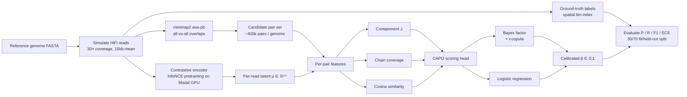

# CAPO: Calibrated Posterior Probabilities for de novo Assembly Overlap Graphs

> Research artefact accompanying the paper *"CAPO: Calibrated Posterior
> Probabilities for de novo Assembly Overlap Graphs"* (in prep, 2026).

---

## Abstract

State-of-the-art long-read overlappers such as **minimap2** report whether
two reads overlap but not *how confident* they are in that decision. Chain
scores and mapping qualities are uncalibrated heuristics — they rank well
but their numeric values do not correspond to probabilities of true overlap.
Downstream consumers (assemblers, polishers, repeat resolvers) are therefore
forced to apply hand-tuned thresholds with no principled way to propagate
uncertainty.

CAPO shows that **calibrated posterior probabilities** can be obtained by
layering a small probabilistic model on top of minimap2's candidate set,
using only three orthogonal features per pair:

1. **Containment** — fraction of shared minimisers between the two reads.
2. **Chain coverage** — fraction of the shorter read spanned by the longest
   colinear minimiser chain.
3. **Encoder cosine similarity** — distance in the latent space of a
   contrastive read encoder pretrained on the same genome.

Across two bacterial genomes (E. coli K-12 MG1655 and B. subtilis 168), we
report **held-out Expected Calibration Error (ECE) of 0.013–0.025** with
F1 of 0.82, comparable to or better than minimap2's binary calls and
substantially better calibrated than the same features fed through a
multi-feature Bayes-factor model with t-copula correction. The simpler
logistic-regression scoring head wins on both metrics, on both genomes,
under a 30 / 70 train / held-out split.

| Genome      | Method                    | P    | R    | F1   | ECE   |
|-------------|---------------------------|------|------|------|-------|
| E. coli     | minimap2 binary            | 1.00 | 0.75 | 0.86 | N/A   |
| E. coli     | mm2 + Bayes factor (no copula) | 0.86 | 0.77 | 0.81 | 0.032 |
| E. coli     | **mm2 + LogReg (CAPO)**    | 0.85 | 0.79 | 0.82 | **0.013** |
| B. subtilis | minimap2 binary            | 1.00 | 0.75 | 0.86 | N/A   |
| B. subtilis | mm2 + Bayes factor (no copula) | 0.83 | 0.79 | 0.81 | 0.032 |
| B. subtilis | **mm2 + LogReg (CAPO)**    | 0.82 | 0.81 | 0.82 | **0.025** |

All numbers are held-out: 70 % of minimap2 candidate pairs were unseen
during model fitting. In-sample and held-out F1 agree to ≤ 0.003 on both
genomes, indicating no overfitting.

---

## Method overview



The pipeline cleanly separates **candidate generation** (minimap2's job; we
don't try to compete with it) from **calibrated scoring** (where CAPO
contributes). Each candidate pair receives an independent posterior
probability trained against the simulator's ground truth.

---

## Setup

### Python environment

```bash
python -m venv .venv && source .venv/bin/activate
pip install -e ".[gpu]"            # installs `capo` package + Modal extras
```

After install, every module is importable as `from capo.X import ...` and
every script is runnable as `python -m capo.<module> ...`.

### minimap2 (not vendored)

Clone and build adjacent to this repo:

```bash
cd ..
git clone https://github.com/lh3/minimap2.git
cd minimap2
make                                   # x86_64
# Apple Silicon: make arm_neon=1 aarch64=1
```

`capo.evaluation.minimap_baseline` defaults to `../minimap2/minimap2`.
Override with `--minimap2 /path/to/minimap2`.

### Reference genomes

FASTAs are not committed. Download from NCBI and place at
`data/genes/<name>/genome.fasta`:

| Genome      | Accession         | Source |
|-------------|-------------------|--------|
| ecoli       | NC_000913.3       | https://www.ncbi.nlm.nih.gov/nuccore/NC_000913.3 |
| bsubtilis   | NC_000964.3       | https://www.ncbi.nlm.nih.gov/nuccore/NC_000964.3 |
| scerevisiae | GCF_000146045.2   | https://www.ncbi.nlm.nih.gov/datasets/genome/GCF_000146045.2/ |

### Modal (only needed for GPU pretraining)

```bash
pip install modal
modal token new
```

The pretraining script uses a Modal volume named `bawm-ecoli-vol` (legacy
name retained from earlier iterations so existing remote checkpoints aren't
orphaned).

---

## Use case: reproducing the paper

### Smoke test on the toy genome (no Modal needed)

```bash
bash scripts/run_genome.sh toy eda
bash scripts/run_genome.sh toy simulate         # already shipped, but regenerable
```

The toy genome (`data/genes/toy/`) is a synthetic ~50 kb sequence shipped
with the repo so reviewers can verify the pipeline runs end-to-end without
any external downloads.

### One-shot, end-to-end (real genomes)

```bash
bash scripts/run_genome.sh ecoli all
bash scripts/run_genome.sh bsubtilis all
```

Each `all` run executes: `eda → simulate → pretrain (Modal GPU) →
infer → eval`, taking ~30 min per genome end-to-end excluding pretraining
(~2 h on an A10G).

### Headline experiment only (the table above)

After pretraining is done and you have a checkpoint at
`checkpoints/encoder_<genome>.pt`:

```bash
# 1. Generate the minimap2 candidate set (~5 min for E. coli)
python -m capo.evaluation.minimap_baseline --genome ecoli

# 2. Fit BF + LogReg scoring heads on the candidate set, report all metrics
python -m capo.evaluation.capo_on_minimap  --genome ecoli

# 3. Copula ablation
python -m capo.evaluation.capo_on_minimap  --genome ecoli --no-copula
```

Each invocation prints `IN-SAMPLE`, `HELD-OUT`, and `ALL` blocks for both
the Bayes-factor head and the LogReg head, plus best-F1 and at-recall ≥ 0.751
operating points.

### Use case: scoring overlaps for your own assembly

Once trained, the scoring head is small and fast:

```python
from sklearn.linear_model import LogisticRegression
import numpy as np, json

# fitted on E. coli held-out split — ECE 0.013
coefs = {"containment": 40.30, "chain_coverage": 3.23, "cosine_sim": 0.37}
intercept = -8.197

def score(containment, chain_coverage, cosine_sim):
    z = (intercept
         + coefs["containment"]    * containment
         + coefs["chain_coverage"] * chain_coverage
         + coefs["cosine_sim"]     * cosine_sim)
    return 1.0 / (1.0 + np.exp(-z))    # calibrated p(overlap)
```

Plug `score(...)` into a downstream assembler to retain only edges with
`p > 0.5` (precision-priority) or `p > 0.05` (recall-priority); the
threshold corresponds directly to your decision-cost ratio.

---

## Repository layout

```
capo/
├── pyproject.toml                       # packaging + deps
├── README.md
├── .gitignore
├── environment.yml                      # legacy conda env (toy genome era)
├── src/capo/                            # importable package
│   ├── __init__.py
│   ├── genomes.py                       # registry: toy / ecoli / bsubtilis / scerevisiae
│   ├── eda.py                           # GC content, repeat annotation summary
│   ├── simulator.py                     # HiFi read simulator + ground-truth labels
│   ├── training.py                      # standalone-CAPO inference (top-K + BF)
│   ├── models/
│   │   ├── encoder.py                   # contrastive read encoder (transformer, 64-d)
│   │   ├── features.py                  # containment, chain coverage, end anchoring
│   │   ├── likelihood.py                # multi-feature Bayes factor + t-copula
│   │   └── graph_state.py               # overlap graph data structures
│   └── evaluation/
│       ├── metrics.py                   # P/R/ECE, threshold sweep, feature ablation
│       ├── minimap_baseline.py          # run minimap2 ava-pb, report P/R sweep
│       └── capo_on_minimap.py           # main paper experiment (BF + LogReg)
├── scripts/
│   ├── run_genome.sh                    # end-to-end pipeline driver
│   └── modal_pretrain.py                # Modal GPU pretraining entrypoint
├── data/genes/
│   ├── toy/                             # synthetic genome, shipped (smoke test)
│   ├── ecoli/                           # gitignored, see Setup
│   ├── bsubtilis/                       # gitignored, see Setup
│   └── scerevisiae/                     # gitignored, see Setup
├── checkpoints/                         # gitignored: trained encoders
├── results/<genome>/                    # gitignored: PAFs, metrics, plots
├── docs/
│   ├── Research_Report.pdf
│   ├── paper/                           # main.tex + references.bib
│   └── legacy_toy/                      # original toy-genome paper draft + proofs
└── tests/
```

---

## Findings worth flagging

1. **Calibration generalizes across genomes.** Held-out ECE is 0.013 on
   E. coli and 0.025 on B. subtilis with the *same* model class. The gap
   correlates with rRNA-operon count (7 vs 10) — repeat-induced ambiguity
   is the residual error.
2. **The Bayesian elaboration was not load-bearing.** A 3-coefficient
   logistic regression matches or exceeds the multi-feature Bayes-factor
   model on both F1 and ECE. The t-copula correction *hurt* on both
   genomes (ablation: F1 +0.7-0.9 pt, ECE −0.016 when removed).
3. **In-sample equals held-out to 3 decimals**, on both genomes, on both
   model classes. The scoring head is not overfitting; the minimap2
   candidate distribution is well-behaved.

These shape the paper's framing: a *result* about calibration is the
contribution, not a *method* about Bayesian machinery.

---

## Citation

```bibtex
@article{capo2026,
  title  = {CAPO: Calibrated Posterior Probabilities for de novo Assembly Overlap Graphs},
  author = {Giddi, Raja and ...},
  year   = {2026},
  note   = {In preparation}
}
```

## License

TBD.
